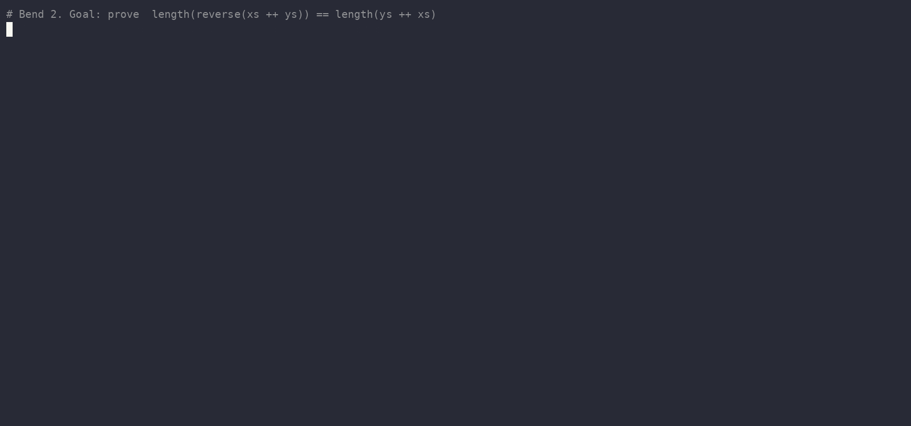

# bendlib

The foundation library for [Bend 2](https://github.com/bendlang/bend): machine-checked facts you
import instead of re-proving, and tools that keep laws honest.

| Part | What | Status |
|---|---|---|
| [`bend-mathlib`](packages/bend-mathlib) | 170 published lemmas (+117 generated `_sym` twins) about `Nat`, `Bool`, `List`, equality — generic, proved, zero `@unsafe` | **0.3.0.0 on BendHub** |
| [`@bendlib/reader`](tools/reader) | Reads Bend source with the official parser of your installed compiler version | working |
| [`lawcheck`](tools/lawcheck) | Finds counterexamples to laws before you try to prove them, and shrinks them; mutation mode shows how well the laws pin each def | v0.2 working |
| [Bend Docs](https://bendlib.github.io/bendlib/) | API docs, checker status and law-shape search for every BendHub package | **live**, rebuilt on a schedule (the footer shows the build time) |

## Use it



```python
import bend-mathlib@0.3.0.0/nat.bend as MNat
import bend-mathlib@0.3.0.0/list.bend as MList

law my_rev:
  for xs: List<&2, U32>
  {List.reverse(&2, U32, List.reverse(&2, U32, xs)) == xs : List<&2, U32>}

def my_rev(xs):
  MList.reverse_reverse(&2, U32, xs)
```

Every lemma with its statement: [packages/bend-mathlib/README.md](packages/bend-mathlib/README.md).
By hash (content-pinned): `import 0x74bdc843cd4bfb31bb6f7ba1eb38d231/nat.bend as MNat`.

## Principles

- **Never breaks dependents.** Published statements are append-only (`PUBLIC_API.lock`), and
  mathlib holds only definitions that stay compatible across its own versions.
- **Zero `@unsafe`.** Every module must print exactly `All terms check.` on the pinned compiler.
- **Built for AI provers too.** Mathlib-standard names, one-line statements, generated
  `_sym` twins for the rewrite direction that simplifies.

The architecture and its evidence are in [PLAN.md](PLAN.md) and [research/experiments](research/experiments).

## Develop

```sh
bun tools/install-bend.ts                          # the pinned compiler (toolchain.json)
bun test tools/                                    # tool tests
bun tools/mathlib/check.ts packages/bend-mathlib   # every module checks
bun tools/mathlib/lint.ts packages/bend-mathlib --erasure
```

## Add a lemma

Put the statement in a module above the `# --- generated: _sym twins …` line, with one `#` doc
sentence above the `law`, one-line claim, proof `def` below. Lawcheck it first, then run the gate:

```sh
bun tools/lawcheck/cli.ts packages/bend-mathlib/nat.bend --law add_comm   # ✓ = no counterexample
bun test tools/
bun tools/comments.ts
bun tools/mathlib/devlib.ts --check
bun tools/mathlib/devlib.ts run -- bun tools/mathlib/check.ts packages/bend-mathlib
for m in $(find packages/bend-mathlib -name '*.bend' | sort); do bun tools/mathlib/devlib.ts run -- bun tools/lawcheck/cli.ts "$m" --max-instances 100 --strict --allow-skip cong2,eq_true_of_ne_false,foldl_op_eq_foldr_op,foldl_op_eq_foldr_op_sym,le_antisymm_eq,le_total,le_total_d,le_total_of_not_le,le_total_true,le_total_true_sym,le_trans3,le_trans4,op_assoc4,op_assoc4_sym,op_comm3,op_comm3_sym,op_four,op_four_sym,op_left_comm,op_left_comm_sym,op_right_comm,op_right_comm_sym,subst || exit 1; done
bun tools/mathlib/lint.ts packages/bend-mathlib --erasure
bun tools/mathlib/twins.ts packages/bend-mathlib --check
bun tools/mathlib/lock.ts packages/bend-mathlib --check
bun tools/mathlib/index.ts packages/bend-mathlib bend-mathlib 0.3.0.0 --check
```

Published statements never change: a fix gets a new name (`PLAN.md` §3.1 rule 2). Full procedure and
proof patterns: `AGENTS.md` → "Adding a lemma to bend-mathlib".

Apache-2.0.
