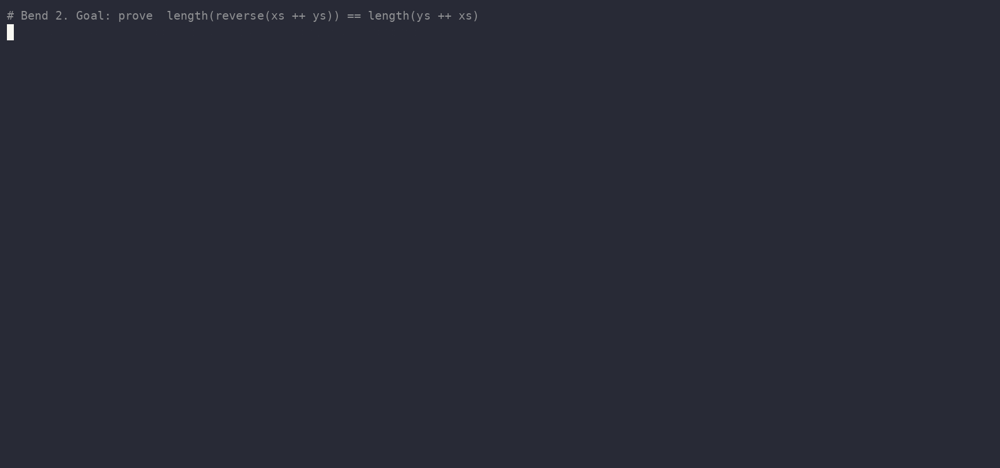

# bendlib

The foundation library for [Bend 2](https://github.com/bendlang/bend): machine-checked facts you
import instead of re-proving, and tools that keep laws honest.

[Docs for every BendHub package](https://bendlib.github.io/bendlib/) ·
[lemma index](packages/bend-mathlib/README.md) ·
[lawcheck](tools/lawcheck) ·
[agent plugin](plugins/bend-mathlib/skills/bend-mathlib/SKILL.md) ·
[good first lemmas](https://github.com/bendlib/bendlib/issues?q=is%3Aopen+label%3A%22good+first+lemma%22)

| Part | What | Status |
|---|---|---|
| [`bend-mathlib`](packages/bend-mathlib) | 445 published lemmas (+299 generated `_sym` twins) about `Nat`, `Bool`, `List`, `String`, `Maybe`, equality — generic, proved, zero `@unsafe` | **0.7.2.0 on BendHub** |
| [`@bendlib/reader`](tools/reader) | Reads Bend source with the official parser of your installed compiler version | working |
| [`lawcheck`](tools/lawcheck) | Finds counterexamples to laws before you try to prove them, and shrinks them; mutation mode shows how well the laws pin each def | **0.3.2**, binaries for Linux and macOS |
| [Bend Docs](https://bendlib.github.io/bendlib/) | API docs, checker status and law-shape search for every BendHub package | **live**, rebuilt on a schedule (the footer shows the build time) |

## Use it



```python
import bend-mathlib@0.7.2.0/nat.bend as MNat
import bend-mathlib@0.7.2.0/list.bend as MList

law my_rev:
  for xs: List<&2, U32>
  {List.reverse(&2, U32, List.reverse(&2, U32, xs)) == xs : List<&2, U32>}

def my_rev(xs):
  MList.reverse_reverse(&2, U32, xs)
```

Every lemma with its statement: [packages/bend-mathlib/README.md](packages/bend-mathlib/README.md).
Proving with an AI agent? Install the plugin, which teaches the agent to find, import and rewrite
with these lemmas instead of re-proving them:

```sh
claude plugin marketplace add bendlib/bendlib
claude plugin install bend-mathlib@bendlib
```

(or `/plugin marketplace add bendlib/bendlib` inside Claude Code). Other agents: copy
[plugins/bend-mathlib/skills/bend-mathlib](plugins/bend-mathlib/skills/bend-mathlib/SKILL.md) into
their skills directory.
By hash (content-pinned): `import 0x449abff091641d732d7b9f0780df40ae/nat.bend as MNat`.

## Check a law before you prove it

```sh
curl -fsSL https://raw.githubusercontent.com/bendlib/bendlib/main/tools/lawcheck/install.sh | sh
lawcheck LAWS.bend
```

lawcheck evaluates every law on many small inputs with the bend checker and shrinks what fails,
so a false statement costs seconds instead of a proof attempt:

```text
✓ ins_length  50 instances, 0 failures (sizes ≤ 3)
✗ ins_sorted  counterexample (shrunk); 9/36 instances failed, premises held in 36/50
             x = 0n
             xs = [1n]
             premise  {is_sorted([1n]) == True{} : Bool}  (holds)
             lhs  is_sorted(ins(0n, [1n])) = False{}
             rhs  True{} = True{}
```

`lawcheck mutate` goes the other way: it breaks your implementation on purpose and reports the
changes your laws fail to notice. Details: [tools/lawcheck](tools/lawcheck).

## Principles

- **Never breaks dependents.** Published statements are append-only (`PUBLIC_API.lock`), and
  mathlib holds only definitions that stay compatible across its own versions.
- **Zero `@unsafe`.** Every module must print exactly `ALL PROOFS CHECK` (and its `--verdict`
  hint line) on the pinned compiler.
- **Checked by the proven kernel.** CI also runs `bend --verdict`, which re-checks every proof in
  BendTT, the kernel whose soundness is proved in Lean: `nat`, `list`, `bool`, `string`, `maybe`,
  `equal`, `perm` and the kernel package pass. `algebra` and `order` wait on
  [bendlang/bend#1182](https://github.com/bendlang/bend/issues/1182) (our fix:
  [#1263](https://github.com/bendlang/bend/pull/1263)); `sort` also needs kinds that depend on a
  run-time value, which BendTT cannot express yet.
- **Built for AI provers too.** Mathlib-standard names, one-line statements, generated
  `_sym` twins for the rewrite direction that simplifies.

The architecture and its evidence are in [PLAN.md](PLAN.md) and [research/experiments](research/experiments).

## Contribute

A lemma you needed in your own proofs is the best contribution: open a PR that adds it (the
layout and the gate are below), or pick one of the
[good first lemmas](https://github.com/bendlib/bendlib/issues?q=is%3Aopen+label%3A%22good+first+lemma%22).
Thanks to [@nohzafk](https://github.com/nohzafk) for the String module, the Nat.div lemmas, and
the move to bend 2.0.34.

## Develop

```sh
bun tools/install-bend.ts                          # the pinned compiler (toolchain.json)
bun test tools/                                    # tool tests
bun tools/mathlib/check.ts packages/bend-mathlib   # every module checks
bun tools/mathlib/lint.ts packages/bend-mathlib --erasure
```

## Add a lemma

Put the statement in a module above the `# --- generated: _sym twins …` line, with one `#` doc
sentence above the `law`, one-line claim, proof `def` below. Lawcheck it first, then run the gate:

```sh
bun tools/lawcheck/cli.ts packages/bend-mathlib/nat.bend --law add_comm   # ✓ = no counterexample
bun test tools/
bun tools/comments.ts
bun tools/mathlib/devlib.ts --check
bun tools/mathlib/devlib.ts run -- bun tools/mathlib/check.ts packages/bend-mathlib
for m in $(find packages/bend-mathlib -name '*.bend' | sort); do bun tools/mathlib/devlib.ts run -- bun tools/lawcheck/cli.ts "$m" --max-instances 100 --strict --allow-skip cong2,eq_true_of_ne_false,foldl_eq_foldr,foldl_eq_foldr_sym,foldl_op_eq_foldr_op,foldl_op_eq_foldr_op_sym,le_antisymm_eq,le_total,le_total_d,le_total_of_not_le,le_total_true,le_total_true_sym,le_trans3,le_trans4,maybe_bind_assoc,maybe_bind_assoc_sym,maybe_bind_map,maybe_bind_map_sym,maybe_map_bind,maybe_map_bind_sym,maybe_map_compose,maybe_map_compose_sym,maybe_map_pure,maybe_map_pure_sym,maybe_pure_bind,maybe_pure_bind_sym,op_assoc4,op_assoc4_sym,op_comm3,op_comm3_sym,op_four,op_four_sym,op_left_comm,op_left_comm_sym,op_right_comm,op_right_comm_sym,subst || exit 1; done
bun tools/mathlib/lint.ts packages/bend-mathlib --erasure
bun tools/mathlib/twins.ts packages/bend-mathlib --check
bun tools/mathlib/lock.ts packages/bend-mathlib --check
bun tools/mathlib/index.ts packages/bend-mathlib bend-mathlib 0.7.2.0 --check
```

Published statements never change: a fix gets a new name (`PLAN.md` §3.1 rule 2). Full procedure and
proof patterns: `AGENTS.md` → "Adding a lemma to bend-mathlib".

Apache-2.0.
